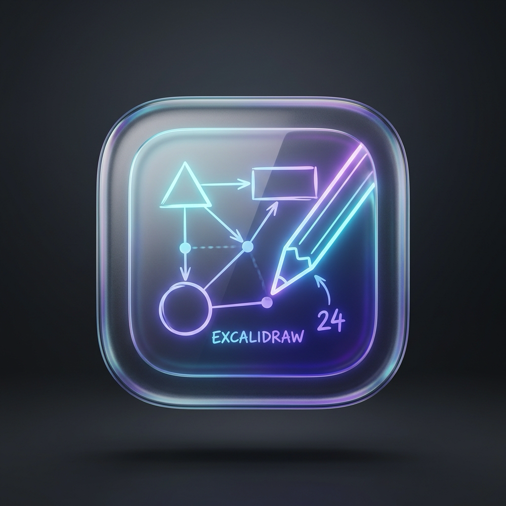
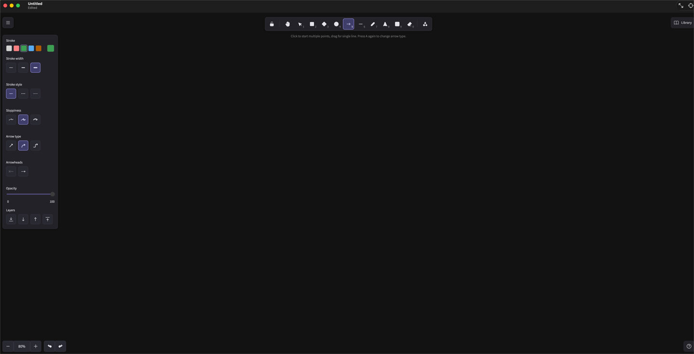

<div align="center">
  
  <h1>Excalidays</h1>
  <p><strong>Local-first native macOS Excalidraw document app.</strong></p>
  <p>New / Open <code>.excalidraw</code> → edit in a local canvas → Save. Files stay on your Mac.</p>

  <p>
    <a href="https://github.com/nodaysidle/excalidays/releases/download/v0.1.0/Excalidays-0.1.0.dmg"><strong>Download v0.1.0 DMG</strong></a>
    ·
    <a href="https://github.com/nodaysidle/excalidays/releases/tag/v0.1.0">v0.1.0 release</a>
    ·
    <a href="https://github.com/nodaysidle/excalidays/releases">All releases</a>
  </p>

  <p>
    
    
    
    
    
    
  </p>
</div>

<p align="center">
  
</p>

macOS only. Native AppKit/SwiftUI document shell with a pinned local Excalidraw WKWebView — not iOS, not a web app, not a cloud product.


## The journey

One loop (Phase 0/1):

```text
New / Open .excalidraw
  → NSDocument owns the file
  → local WKWebView loads bundled Excalidraw 0.18.1
  → draw / edit
  → Save (native dirty + snapshot)
```

| Stage | What happens |
|---|---|
| **New / Open** | Standard macOS document flow creates or opens a `.excalidraw` file. |
| **Document** | `NSDocument` (`ExcalidaysDocument`) owns bytes, dirty state, and safe save. |
| **Canvas** | One isolated local `WKWebView` per document loads the bundled Excalidraw runtime (no CDN). |
| **Edit** | Drawing stays Excalidraw; the shell forwards undo/redo and tracks dirty via a typed bridge. |
| **Save** | Explicit snapshot round-trips scene / files / compatible unknown fields back to disk. |

## What it does (Phase 0/1)

- Create, open, edit, and save `.excalidraw` documents on macOS 14+
- Real `NSDocument` / window lifecycle with native dirty indication
- Bundled local Excalidraw 0.18.1 + fonts (offline canvas; CSP `connect-src 'none'`)
- Typed canvas bridge with operation allowlist; undo/redo menu forwarding
- Ad-hoc packaged `.app` / DMG for local install

## What it does **not** (yet)

Phases **2–7 are not started** as product features:

| Phase | Not shipped |
|---|---|
| **2** | Finder polish, organizer (recents/favorites/tags/workspaces), full menus/toolbar |
| **3** | Image / SVG / PDF import workflows |
| **4** | PNG / SVG / PDF / pasteboard export workflows |
| **5** | In-app history / checkpoints |
| **6** | Full interaction, accessibility, and performance evidence |
| **7** | Notarized Developer ID release |

Also out of scope forever for this product shape: **accounts, cloud sync, collaboration, analytics, AI drawing, iOS / mobile**.

Scaffolded library/settings UI is not a completed organizer or settings product.


## Format truth

| Format | Behavior in Excalidays |
|---|---|
| `.excalidraw` | Editable. Official runtime restore/serialize; preserve elements, app state, files, attachments, compatible unknown top-level fields. |
| Scene-embedded PNG/SVG | Detected and editable **when** Phase 3 lands — **not** shipped in 0.1.0. |
| Ordinary PNG/JPEG/WebP/GIF/HEIC/SVG | Become **image elements** when import lands — pixels/paths are **not** native Excalidraw shapes. **Not** shipped in 0.1.0. |
| PDF pages | Bounded **image elements** via PDFKit when import lands — no OCR / vector-to-shape. **Not** shipped in 0.1.0. |

## Stack

| Layer | Technology |
|---|---|
| Shell | AppKit + SwiftUI, Swift 6, macOS 14+ |
| Documents | NSDocument / NSDocumentController |
| Build | XcodeGen (project.yml) + xcodebuild |
| Canvas | Local WKWebView + bundled @excalidraw/excalidraw 0.18.1 |
| Canvas build | Node and Vite |
| Isolation | sandboxed; user-selected files; bookmarks; WebKit JIT |

## Network entitlement note

The app includes `com.apple.security.network.client` because WebKit/JIT sandboxes often require it. **Excalidays is not a cloud product**: the canvas is bundled locally, remote script/font/CDN fallbacks are denied, and there are no accounts, sync, or analytics. See `SECURITY.md` and `THIRD_PARTY_NOTICES.md`.


## Releases

Public **v0.1.0** ships an ad-hoc signed DMG (not notarized).

<!-- Updated after gh release create with the real asset URL -->

- **Download:** [`Excalidays-0.1.0.dmg`](https://github.com/nodaysidle/excalidays/releases/download/v0.1.0/Excalidays-0.1.0.dmg)
- **Release page:** https://github.com/nodaysidle/excalidays/releases/tag/v0.1.0
- **Tag:** `v0.1.0`
- First launch on a fresh Mac: Control-click — **Open** — confirm (Gatekeeper + ad-hoc signature).

## Build from source

Requirements: macOS 14+, Xcode / Swift 6 toolchain, Node 22 + npm 11, [XcodeGen](https://github.com/yonaskolb/XcodeGen).

```sh
Scripts/bootstrap.sh      # npm ci (CanvasRuntime) + xcodegen
Scripts/test_all.sh       # canvas tsc/vitest + ExcalidaysTests
Scripts/build_app.sh Debug
Scripts/package_app.sh    # Release ‒ Artifacts/Excalidays.app
Scripts/verify_app.sh
```

Do not install to /Applications unless you intend to; packaging writes `Artifacts/Excalidays.app`.

## License

The Excalidays application license is **unset** (owner-controlled). Third-party software retains its licenses — see [`THIRD_PARTY_NOTICES.md`](THIRD_PARTY_NOTICES.md) (Excalidraw 0.18.1 MIT and bundled font notices).
